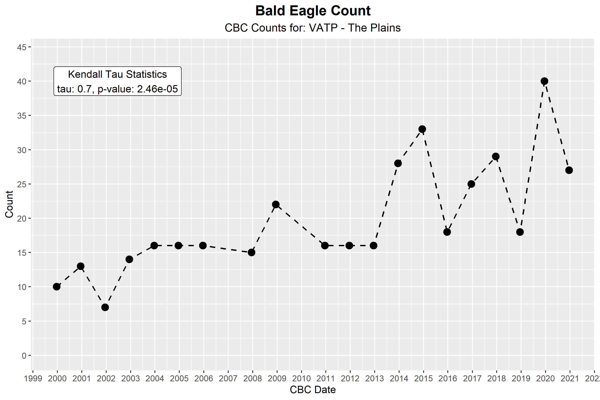
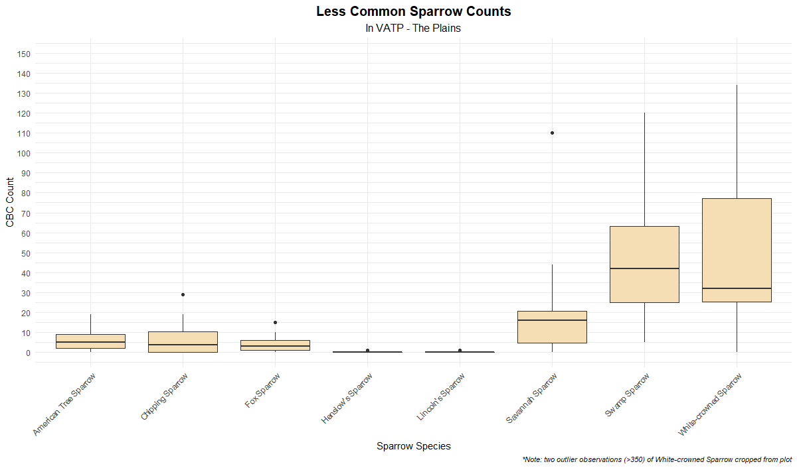

# Christmas Bird Count Data Cleaner

The R scripts in this repo transform CSV files from [Audubon's Christmas Bird Count® portal](https://netapp.audubon.org/CBCObservation/Historical/ResultsByCount.aspx) into more wieldable tables for data analysis. Per the National Audobo Society's website "*CBC Data are provided by National Audubon Society and through the generous efforts of Bird Studies Canada and countless volunteers across the Western Hemisphere.*" More information can be found at links below:

- www.audubon.org
- www.christmasbirdcount.org
- www.bsc-eoc.org (for Canadian users)

_**NOTE**: The master CBC database is owned and maintained by Audubon and the most current data can be found there_

## Features

The main purpose of this repo is the `parse_cbc_csv_file` function found in `cleaning_scripts.R`. This function reads in a CBC CSV files and returns a named list with post processed information for ease of us. This information is in the form of a named list with the following:

- abbreviation = Abbreviation for CBC circle name
- circle_name = Name of CBC Circle name
- latitude = latitude of CBC circle location
- longitude = longitude of CBC circle location
- long_bird_data = Data frame containing "melted" list of observations. Useful for plotting
- complete_scientific_df = Dataframe with CBC data using bird's scientific names for columns
- complete_common_name_df = Dataframe with CBC data using bird's common names for columns

Additional analysis includes Kendall Tau statistics for all the species in the circle to judge if populations are increasing or decreasing in a statistically significant manner. The `get_kendall_tau_statistics` function found in `cleaning_scripts.R` produces both tau and p-values for each species in the dataset.

## Example Studies

This repo also includes very basic analyses performed using the post-processed data in R along with the R library, `ggplot2`.
These examples can be found in `process_cbc_data.R`.

