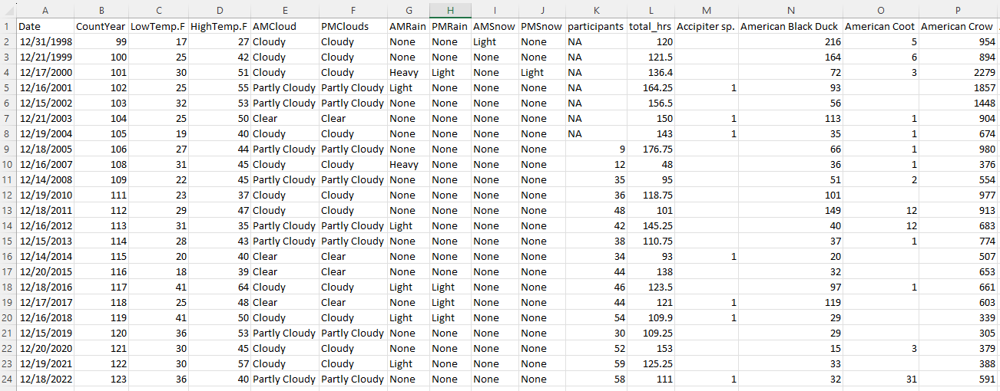
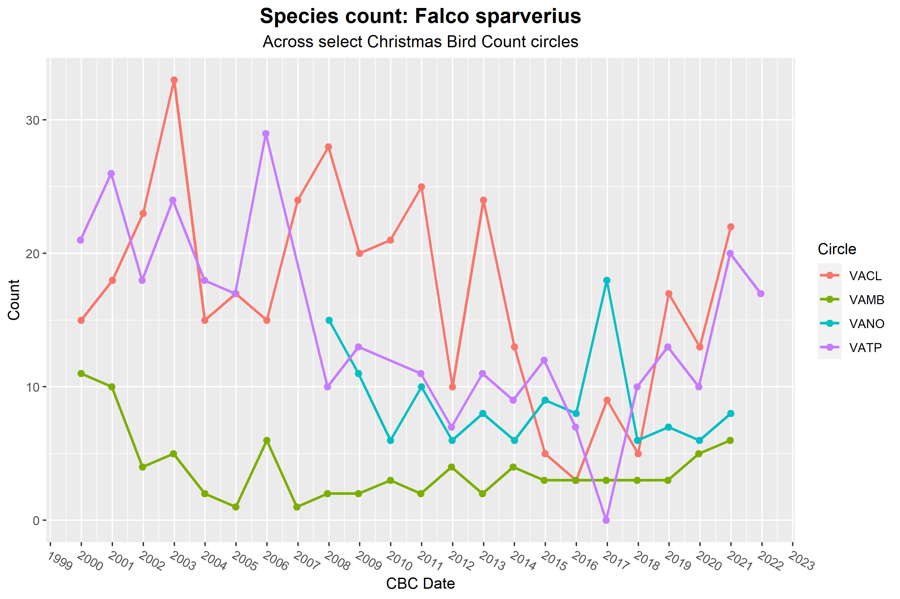

# Christmas Bird Count Data Cleaner

The R scripts in this repo transform CSV files from [Audubon's Christmas Bird Count® portal](https://netapp.audubon.org/CBCObservation/Historical/ResultsByCount.aspx) into more wieldable tables for data analysis. Per the National Audobon Society's website "*CBC Data are provided by National Audubon Society and through the generous efforts of Bird Studies Canada and countless volunteers across the Western Hemisphere.*" More information can be found at links below:

- www.audubon.org
- www.christmasbirdcount.org
- www.bsc-eoc.org (for Canadian users)

_**NOTE**: The master CBC database is owned and maintained by Audubon and the most current data can be found there_

## Features

The main purpose of this repo is the `parse_cbc_csv_file` function found in `cleaning_scripts.R`. This function reads in CBC CSV files and returns a named list with post processed information for ease of us. This information is in the form of a named list with the following:

- abbreviation = Abbreviation for CBC circle name
- circle_name = Name of CBC Circle name
- latitude = latitude of CBC circle location
- longitude = longitude of CBC circle location
- long_bird_data = Data frame containing "melted" list of observations. Useful for plotting
- complete_scientific_df = Dataframe with CBC data using bird's scientific names for columns
- complete_common_name_df = Dataframe with CBC data using bird's common names for columns



Additional analysis includes Kendall Tau statistics for all the species in the circle to judge if populations are increasing or decreasing in a statistically significant manner. The `get_kendall_tau_statistics` function found in `cleaning_scripts.R` produces both tau and p-values for each species in the dataset.

### Example Code

```r
setwd(dirname(rstudioapi::getActiveDocumentContext()$path))

source('cleaning_scripts.R')

# Data pulled from:
# -https://netapp.audubon.org/CBCObservation/Historical/ResultsByCount.aspx

file_name = "vatp_2000_2021.csv" #<-- must be in same directory as this script

# ---------- Parse CBC CSV file and compile a clean table by year ----------

cbc_data = parse_cbc_csv_file(file_name)

# Pull out data from cbc_data object
abbreviation = cbc_data$abbreviation
circle_name = cbc_data$circle_name
lat = cbc_data$latitude 
long = cbc_data$longitude 
melted_bird_count_df = cbc_data$long_bird_data
complete_scientific_df = cbc_data$complete_scientific_df 
complete_common_name_df = cbc_data$complete_common_name_df

# ----------------------------- Write out files ------------------------------

file_name_prefix = paste(abbreviation,circle_name,lat,long, sep = "_")
file_name_sci = paste0(file_name_prefix, "_scientific_names.csv")
file_name_com = paste0(file_name_prefix, "_common_names.csv")
file_name_tau = paste0(file_name_prefix, "_kendall_tau.csv")

# Creates a directory for the circle if one doesnt exist
circle_directory = file.path(getwd(), "circles", abbreviation)
dir.create(circle_directory, showWarnings = FALSE)

write.csv(complete_scientific_df, file =  file.path(getwd(), "circles", abbreviation, file_name_sci), row.names = FALSE)
write.csv(complete_common_name_df, file = file.path(getwd(), "circles", abbreviation, file_name_com), row.names = FALSE)


#----------------------------STATISTICS-----------------------------------------

# Write out Kendall Tau statistics for every species in data
kendall_tau_df = get_kendall_tau_statistics(complete_common_name_df)
write.csv(kendall_tau_df, file = file.path(getwd(), "circles", abbreviation, file_name_tau), row.names = TRUE)
```


## Example Studies

This repo also includes very basic analyses performed using the post-processed data in R along with the R library, `ggplot2`.
These examples can be found in `process_cbc_data.R`.





